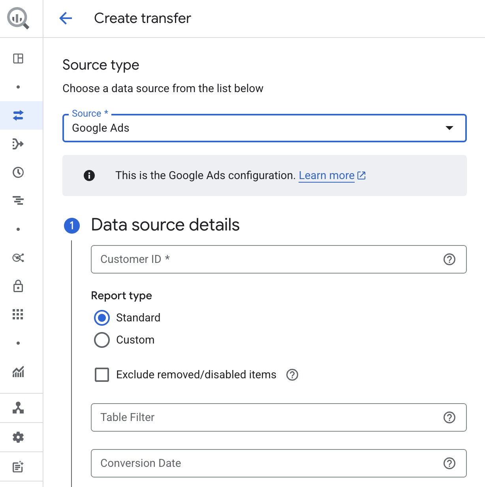
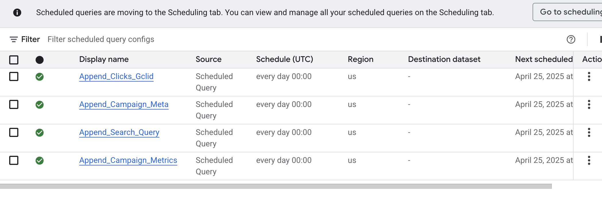
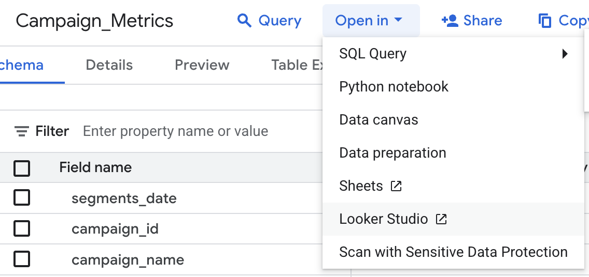
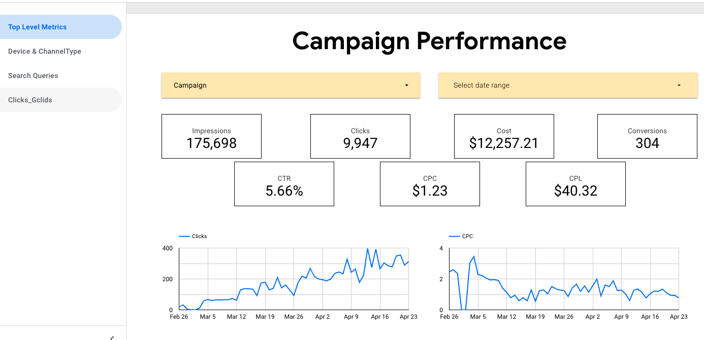
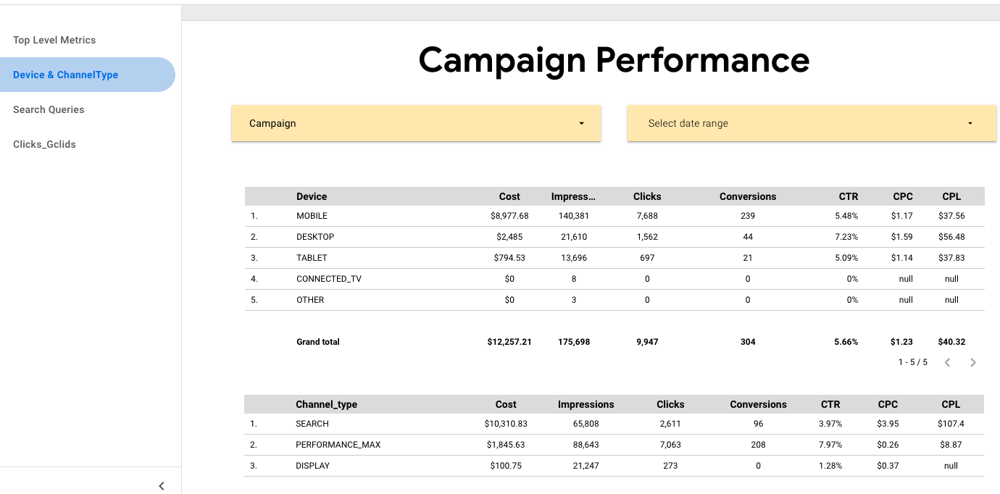
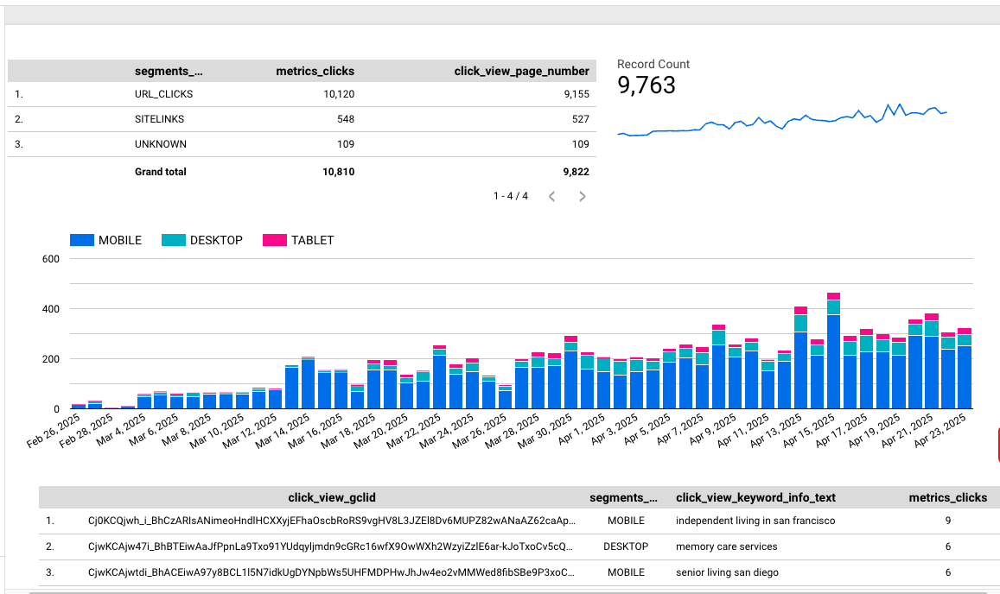
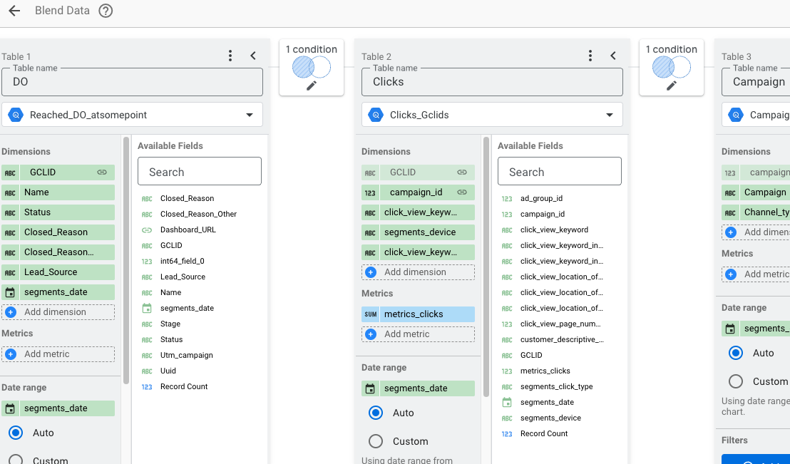

[PORTFOLIO_HOME](https://satyjais.github.io/)

## ETL and dashboarding using Google BigQuery(SQL) & Looker Studio
Data streamlining, integration &amp; automation project 

# Business Background
As the Account/Data Manager for a digital advertising project with a senior living marketplace in the U.S., I was tasked with building a dashboard to monitor campaign performance — both for internal use and for client reporting.

The client’s data team provided a Looker dashboard that tracked key post-lead metrics. Meanwhile, my team was responsible for guiding the client in setting up a Google Ads dashboard focused on pre-lead performance indicators such as spend, CTR, CPC, and CPL. These metrics were to be broken down by device type, ad type, gender, and age group.
The objective was not just to track pre-lead trends, but also to establish a clear connection between ad spend, individual keywords & clicks and lead generation & quality.

# Challenge
One of the major hurdles was integrating Google Ads data with the client's CRM data (lead records). The challenge stemmed from difficulties in locating the correct tables and metrics within the client’s existing data infrastructure, limiting our ability to create a seamless connection between marketing efforts and lead outcomes.

# Solution
## Step 1 - Data Ingestion 
Bringing Google Ads data into the data warehouse - BigQuery.



## Step 2 - Date Cleaning & Transformation
Next I created the metadata required to combine metrics from different tables for an integrated view.

### Step 2.1 - Creating Metadata for campaigns
```sql
SELECT
  DISTINCT(campaign_id),
  campaign_name,
  campaign_advertising_channel_type,
  campaign_advertising_channel_sub_type,
  campaign_start_date,
  campaign_serving_status,
FROM
  `aroscop-456222.********_Adwords.ads_Campaign_9925610920`
WHERE
  campaign_start_date >'2025-02-25'
```


### Step 2.2 - Getting metrics & dimensions for Campaigns
```sql
SELECT
  segments_date,
  Campaign.campaign_id,
  Meta.campaign_name,
  Meta.campaign_advertising_channel_type,
  Campaign.metrics_impressions,
  Campaign.metrics_clicks,
  Campaign.metrics_conversions,
  Campaign.segments_device,
  round(Campaign.metrics_cost_micros/1000000,2) as cost
FROM
  `aroscop-456222.********_Adwords.ads_CampaignBasicStats_9925610920` AS Campaign
LEFT JOIN
  `Cleaned_Data_Metadata_********.Campaign_Meta` AS Meta
USING
  (campaign_id)
ORDER BY
segments_date
```
###  Step 2.3 - Clicks Ids & related metrics 
```sql
Select
  click_view_gclid,
  Clicks.campaign_id,
  ad_group_id,
  metrics_clicks,
  click_view_page_number,
  click_view_keyword,
  click_view_keyword_info_match_type,
  click_view_keyword_info_text,
  click_view_location_of_presence_city,
  click_view_location_of_presence_metro,
  click_view_location_of_presence_most_specific,
  customer_descriptive_name,
  segments_click_type,
  segments_device,
  segments_date
FROM
  `********_Adwords.ads_ClickStats_9925610920` AS Clicks
LEFT OUTER
JOIN
`Cleaned_Data_Metadata_********.Campaign_Meta`
using(campaign_id)
ORDER BY
  segments_date
```

###  Step 2.4 - Keyword level information
```sql
SELECT
  ad_group_id,
  campaign_id,
  Meta.campaign_name,
  ad_group_criterion_criterion_id,
  ad_group_criterion_keyword_match_type,
  ad_group_criterion_keyword_text,
  ad_group_criterion_negative,
  ad_group_criterion_position_estimates_estimated_add_clicks_at_first_position_cpc,
  ad_group_criterion_position_estimates_estimated_add_cost_at_first_position_cpc,
  ad_group_criterion_position_estimates_first_page_cpc_micros,
  ad_group_criterion_quality_info_post_click_quality_score
FROM
  `aroscop-456222.********_Adwords.p_ads_Keyword_9925610920` as Keywords
LEFT JOIN
  `Cleaned_Data_Metadata_********.Campaign_Meta` as Meta
  Using (campaign_id)
Where
 Meta.campaign_start_date >='2025-02-25'
```

### Step 2.4 -  Search queries (accept those that have been acted upon (added to keywords or negatives)

```sql
SELECT
  sqt.segments_date,
  sqt.campaign_id,
  cmp.campaign_name,
  sqt.ad_group_id,
  sqt.ad_group_ad_ad_id,
  sqt.metrics_impressions,
  sqt.metrics_clicks,
  sqt.metrics_conversions,
  sqt.metrics_all_conversions,
  sqt.metrics_cost_micros/1000000 AS cost,
  sqt.segments_device,
  sqt.search_term_view_status,
  sqt.search_term_view_search_term
FROM
  `********_Adwords.ads_SearchQueryStats_9925610920` AS sqt
LEFT JOIN
  `Cleaned_Data_Metadata_********.Campaign_Meta`AS cmp
USING
  (campaign_id)
WHERE
  cmp.campaign_start_date > '2025-02-25'
  AND sqt.search_term_view_status = 'NONE'
```
## Step 4 Pipeline Orchestration
The final step for the data warehousing was to create auto **refreshes** and **appends** to the tables created earlier.

### Appending campaign metadata (as new campaigns launch)
``` sql
INSERT INTO
`Cleaned_Data_Metadata_********.Campaign_Meta`
SELECT
  campaign_id,
  campaign_name,
  campaign_advertising_channel_type,
  campaign_advertising_channel_sub_type,
  campaign_start_date,
  campaign_serving_status,
FROM
  `********_Adwords.p_ads_Campaign_9925610920` AS Campaign
WHERE
  NOT EXISTS (
  SELECT
    campaign_id
  FROM
    `aroscop-456222.Cleaned_Data_Metadata_********.Campaign_Meta`
  WHERE
    campaign_id = Campaign.campaign_id )
  AND Campaign.campaign_start_date >'2025-02-25'
  AND Campaign.campaign_name <> **********************  (duplicate campaign name)
```

### Appending campaign metrics

```sql
Insert INTO
`Cleaned_Data_Metadata_********.Campaign_Metrics`
SELECT
  segments_date,
  Campaign.campaign_id,
  Meta.campaign_name,
  Meta.campaign_advertising_channel_type,
  Campaign.metrics_impressions,
  Campaign.metrics_clicks,
  Campaign.metrics_conversions,
  Campaign.segments_device,
  round(Campaign.metrics_cost_micros/1000000,2) as cost
FROM
  `aroscop-456222.********_Adwords.ads_CampaignBasicStats_9925610920` AS Campaign
LEFT JOIN
  `Cleaned_Data_Metadata_********.Campaign_Meta` AS Meta
USING
  (campaign_id)
Where Campaign.segments_date > (select max(segments_date) from `Cleaned_Data_Metadata_********.Campaign_Metrics`)
ORDER BY
segments_date
```

### Appending Clicks_Gclid metrics

```sql
INSERT INTO
`Cleaned_Data_Metadata_********.Clicks_Gclids`
Select
  click_view_gclid,
  Clicks.campaign_id,
  ad_group_id,
  metrics_clicks,
  click_view_page_number,
  click_view_keyword,
  click_view_keyword_info_match_type,
  click_view_keyword_info_text,
  click_view_location_of_presence_city,
  click_view_location_of_presence_metro,
  click_view_location_of_presence_most_specific,
  customer_descriptive_name,
  segments_click_type,
  segments_device,
  segments_date
FROM
  `********_Adwords.ads_ClickStats_9925610920` AS Clicks
LEFT OUTER
JOIN
`Cleaned_Data_Metadata_********.Campaign_Meta`
using(campaign_id)
Where Clicks.segments_date > (select max(segments_date) from `Cleaned_Data_Metadata_********.Clicks_Gclids`)
AND
not exists
(select * from `Cleaned_Data_Metadata_********.Clicks_Gclids` as Old
WHERE
  Old.click_view_gclid = Clicks.click_view_gclid
)
ORDER BY
  Clicks.segments_date
```

### Append Search Queries data

```sql
INSERT INTO
`Cleaned_Data_Metadata_********.Search_Queries`
SELECT
  sqt.segments_date,
  sqt.campaign_id,
  cmp.campaign_name,
  sqt.ad_group_id,
  sqt.ad_group_ad_ad_id,
  sqt.metrics_impressions,
  sqt.metrics_clicks,
  sqt.metrics_conversions,
  sqt.metrics_all_conversions,
  sqt.metrics_cost_micros/1000000 AS cost,
  sqt.segments_device,
  sqt.search_term_view_status,
  sqt.search_term_view_search_term
FROM
  `********_Adwords.ads_SearchQueryStats_9925610920` AS sqt
LEFT JOIN
  `Cleaned_Data_Metadata_********.Campaign_Meta`AS cmp
USING
  (campaign_id)
WHERE
  cmp.campaign_start_date > '2025-02-25'
  AND sqt.search_term_view_status = 'NONE'
  AND sqt.segments_date > (select max(segments_date) from `Cleaned_Data_Metadata_********.Search_Queries`)
```

### Scheduling the Queries to run each day



## Step 4 - Bringing the cleaned and transformed data to Looker Studio.





## Step 5 - Creating the dashboard and exposing GCLIDs for client to connect to their leads information (CRM)

**Sample Dashboard images - **







## Step 6 - Joining tables - CRM & Google Ads, to map each lead to campaign, keywords, and locations.
To understand the impact of keywords, campaigns, devices, and locations on leads' quality and identify any trends.


